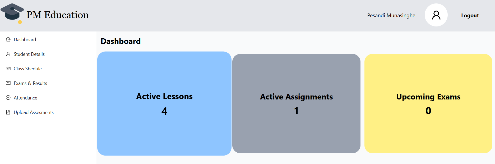
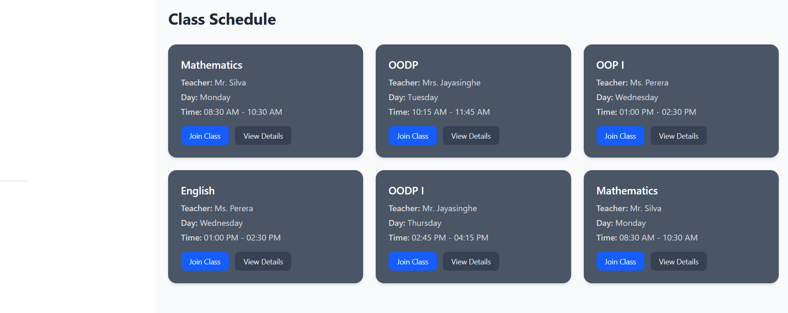
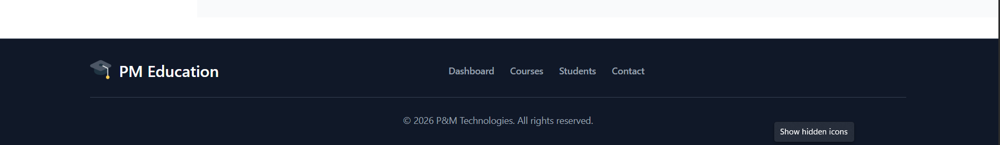

<h1>Frontend Dashboard design</h1>
<h2>This is one of my dashboard design using Reactjs + Tailwindcss + ANT Design</h2>

This LMS offers a centralized interface that allows users to access academic resources, manage classes, track progress, and interact through an intuitive and user-friendly dashboard.
Developed using React.js, Tailwind CSS, and ANT Design for the front-end, the LMS ensures a modern, responsive, and visually appealing user experience. The project focuses on automating day-to-day academic tasks and improving collaboration in an educational environment.
The system comprises multiple modules, including Dashboard, Class Management, Student Information, Schedule Management, and Report Generation. Each module is designed with clarity and accessibility in mind, ensuring that teachers, students, and administrators can easily interact with the system.
Overall, this LMS Dashboard enhances productivity and transparency within educational institutions by integrating all essential academic operations into one digital platform.

 

 
<h1>References</h1>

Ant.design. (2025). Menu - Ant Design. [online] Available at: https://ant.design/components/menu [Accessed 16 Oct. 2025].

Ant.design. (2025). Icon - Ant Design. [online] Available at: https://ant.design/components/icon [Accessed 16 Oct. 2025].

Tailwindcss.com. (2025). Tailwind CSS Footers - Official Tailwind UI Components. [online] Available at: https://tailwindcss.com/plus/ui-blocks/marketing/sections/footers [Accessed 16 Oct. 2025].

Tailwindcss.com. (2025). Buttons - Tailwind CSS. [online] Available at: https://v1.tailwindcss.com/components/buttons [Accessed 16 Oct. 2025].

Github.io. (2025). React icons preview for vsc. [online] Available at: https://react-icons.github.io/react-icons/icons/vsc/ [Accessed 16 Oct. 2025] - user Icon.

